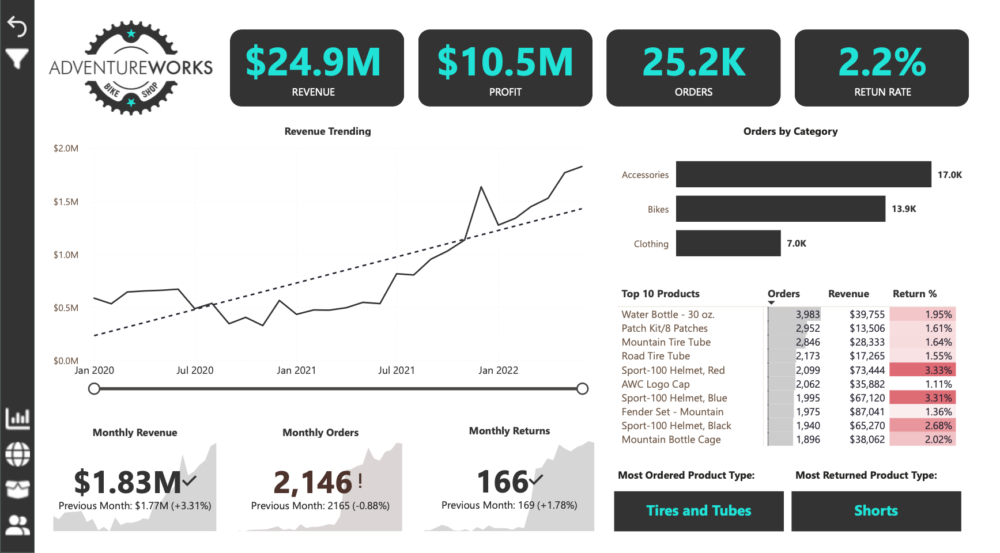
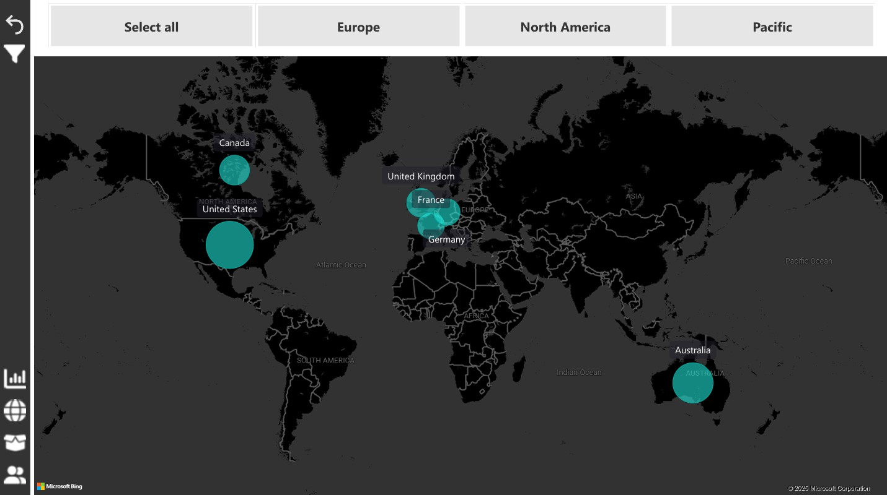
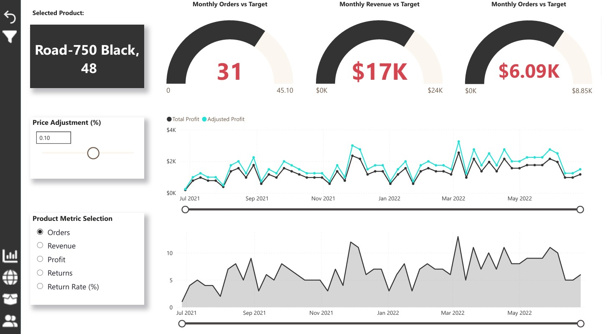
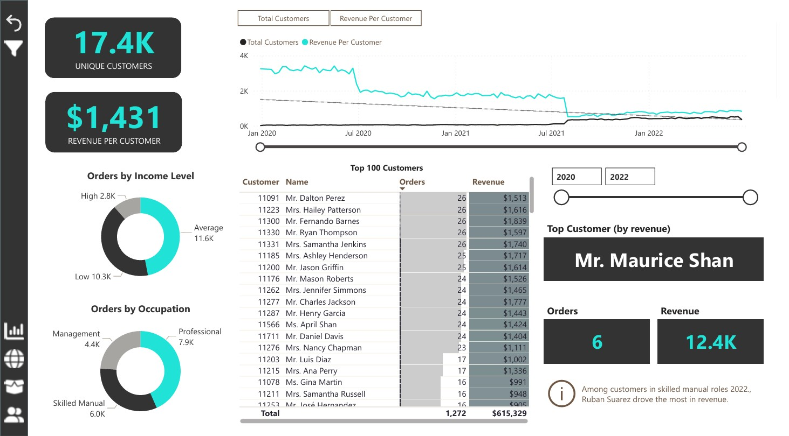
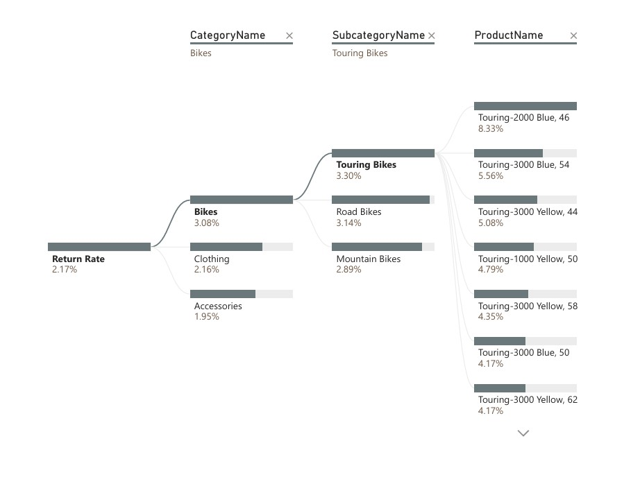
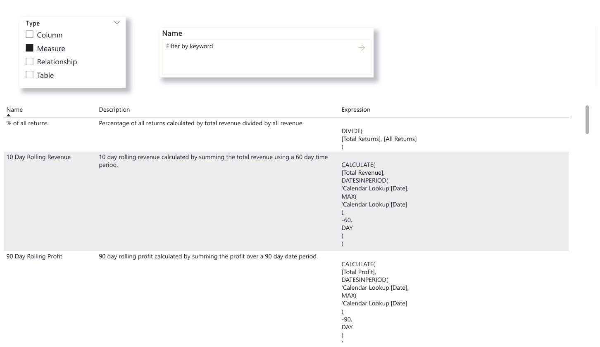

# Adventure Works Sales Dashboard | Power BI Project

## Overview
This project was created as part of the [Maven Analytics - Microsoft Power BI for Business Intelligence](https://www.mavenanalytics.io/course/microsoft-power-bi-for-business-intelligence) course. Using the Adventure Works sales dataset, I developed an interactive dashboard to analyze company sales performance across different products, territories, and time periods.

The goal of this project was to practice key BI skills including:
- Data modelling
- DAX calculations
- Designing impactful dashboards
- Extracting actionable business insights
- ETL/ELT Concepts

---

## Dataset
The Adventure Works dataset is a fictional corporate database created by Microsoft, designed to simulate real-world business operations. It includes:
- Sales Orders
- Customers
- Territories
- Products
- Employees
- Categories
- Dates

---

## Key Metrics & KPIs
- Total Sales Revenue
- Total Quantity Sold
- Total Profit
- Return Rate
- Average Unit Price
- Top-Selling Products
- Sales by Region/Territory
- Year-over-Year Growth
- Customer Segmentation

---

## Business Insights
- **Top Territory:** North America consistently outperformed other regions in total revenue.
- **Best-Selling Product:** Road Bikes represented the largest share of revenue among product categories.
- **Seasonality Trends:** Sales peaked during Q2 and Q4, suggesting opportunities for seasonal promotions.
- **Customer Insights:** A small segment of customers (top 20%) contributed to a majority of the revenue, highlighting a potential for loyalty programs.
- **Growth Areas:** Certain underperforming territories showed YoY growth, indicating markets worth nurturing.
- **Top Customer:** Mr Ruben Suarez was the top customer spending over up to 5K.
- **Return Rate:** The highest return rate causing a loss was from the **Road Bike - Road-650-red 52** with a return rate of 11.76%.
---

## Power BI Techniques Used
- ETL and Data cleaning in Power Query
- Building a star schema data model
- Creating calculated columns and advanced measures in DAX E.G. CALCULATE, FILTER, ALL and RELATED were commonly used here
- Implementing dynamic filters and slicers
- Designing a user-friendly and visually intuitive dashboard
- Working in a performance minded approach
- Using drill throughs and decomposition trees to uncover interesting insights
- Contextual custom tooltips
- Data dictionary for detailed documentation on measures, using the new DAX INFO functions.

---

## Project Screenshots

---

## How to Use
1. Download the `.pbix` file from the repository.
2. Open in Power BI Desktop.
3. Explore interactive visualizations and filters to discover insights.
